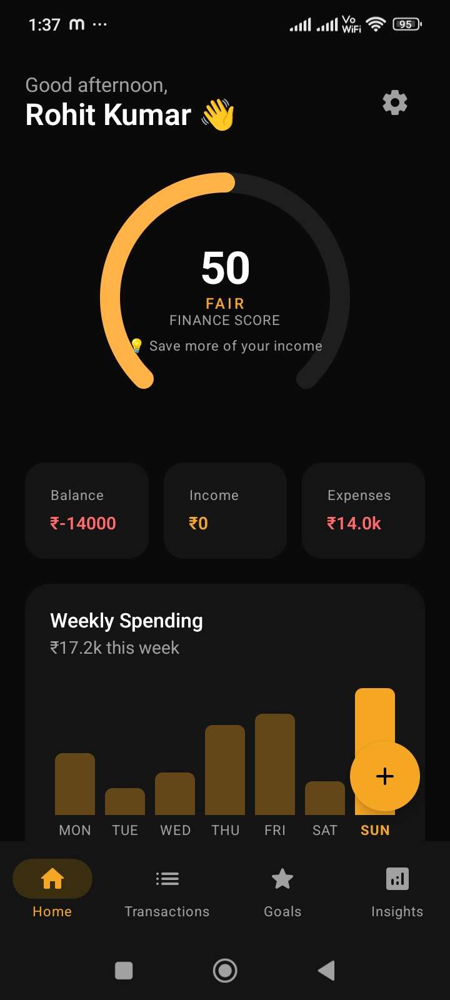
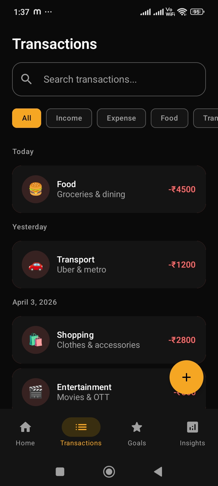
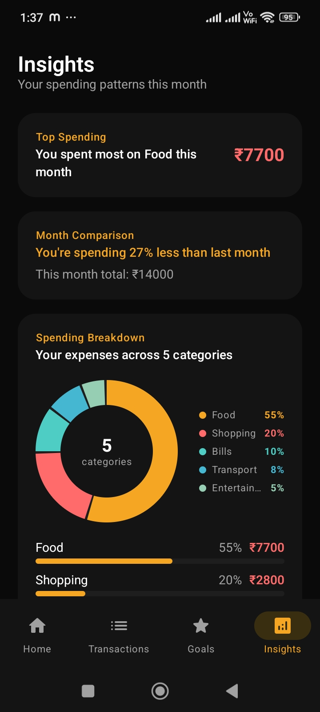
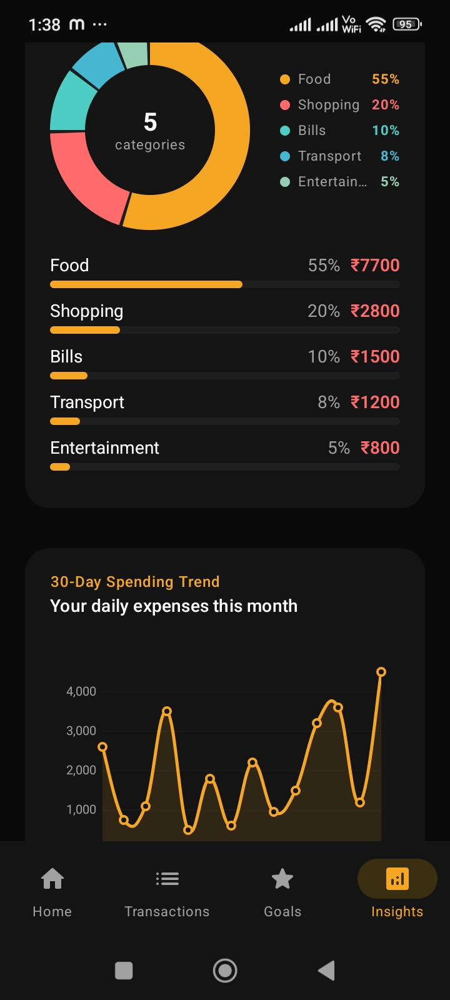
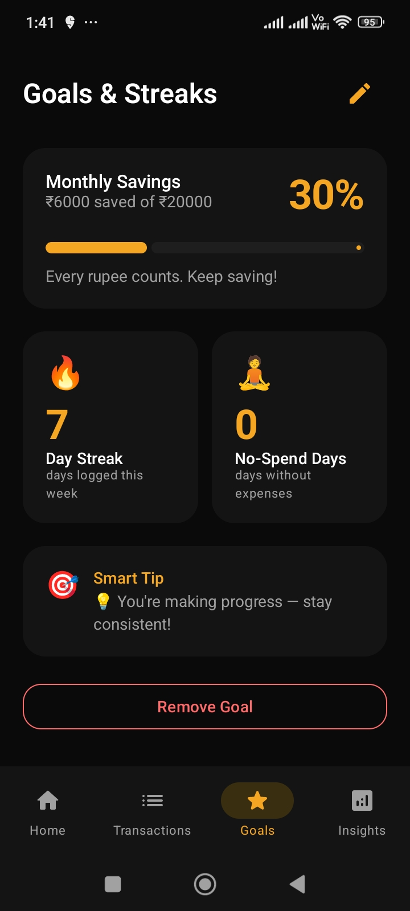
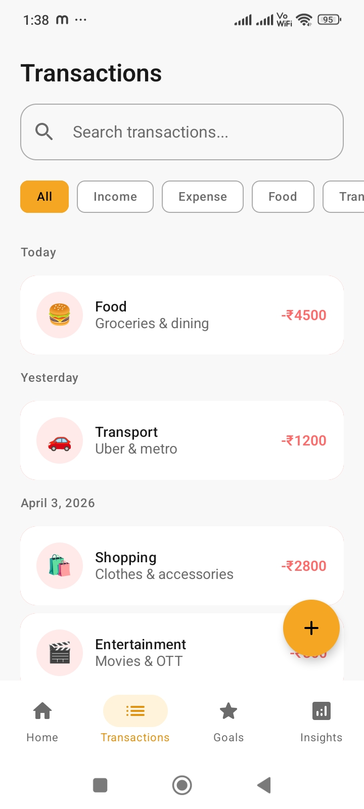

# Flo — Personal Finance Companion

A thoughtfully designed Android application that helps users understand their daily money habits through an engaging, data-driven experience.

Built as part of the Zorvyn Mobile App Developer Intern assignment.

---

## 📱 Demo

| | Link |
|---|---|
| 📹 Demo Video | [Watch Demo](https://drive.google.com/file/d/13duT-T2DqJlGy05V5RPyyiAEVsJHBu52/view?usp=sharing) |
| 📦 Download APK | [Download](https://drive.google.com/file/d/1GusfQnKVmiS1P5RrpSJrm7l-xmUfIqSe/view?usp=sharing) |

---

## 📸 Screenshots

<p align="center">
  
  
  
  
  
   
</p>


## ✨ What Makes Flo Different

Most finance apps are passive — they record what you did. Flo is active — it notices patterns, celebrates wins, nudges you gently, and gives you a **Finance Score** that updates daily based on your actual behavior.

The Finance Score (0–100) is calculated from:
- **Budget adherence** — how well you're staying within your monthly budget
- **Logging streak** — consistency in tracking your finances daily
- **Savings rate** — percentage of income you're saving
- **No-spend days** — days this week with zero expenses
- **Goal progress** — how close you are to your savings target

This single number ties every feature together and makes finance feel engaging without being gimmicky.

---

## 🏗️ Architecture

Flo follows **Clean Architecture** with **MVVM**, organized into three distinct layers:
```
UI Layer          → Jetpack Compose screens + ViewModels
Domain Layer      → Use Cases (business logic)
Data Layer        → Repository + Room + DataStore
```
```
com.flo.app
├── data/
│   ├── local/          # Room database, DAOs, DataStore
│   ├── model/          # UI models (Transaction, Goal, HealthScore)
│   └── repository/     # Single source of truth
├── domain/
│   └── usecase/        # GetFinancialSummaryUseCase, CalculateHealthScoreUseCase, GetInsightsUseCase
├── ui/
│   ├── components/     # Reusable composables (FloCard, DonutChart, SpendingLineChart)
│   ├── navigation/     # NavGraph, BottomNavBar, NavRoutes
│   ├── screens/        # One package per screen
│   └── theme/          # Color, Typography, Theme
└── di/                 # Hilt dependency injection module
```

### Why Use Cases?

ViewModels in most projects get bloated with business logic. Use cases extract that logic into single-responsibility classes — `CalculateHealthScoreUseCase` does exactly one thing, is completely testable, and has zero Android dependencies.

---

## 🛠️ Tech Stack

| Category | Technology |
|---|---|
| Language | Kotlin |
| UI | Jetpack Compose + Material 3 |
| Architecture | MVVM + Clean Architecture |
| Database | Room (SQLite) |
| Preferences | DataStore |
| Dependency Injection | Hilt |
| Navigation | Navigation Compose |
| Charts | MPAndroidChart (line chart) + Custom Canvas (donut, bar) |
| Async | Kotlin Coroutines + Flow |

---

## 📋 Features Implemented

### ✅ Home Dashboard
- Personalized greeting based on time of day
- Animated Finance Score ring (0–100) with contextual tip
- Monthly summary cards — Balance, Income, Expenses
- Weekly spending bar chart with today highlighted
- Goal progress with animated linear indicator
- Recent transactions with empty state

### ✅ Transaction Tracking
- Add, edit, delete transactions
- Swipe left to delete with visual confirmation
- Filter by type (Income/Expense) and category
- Search by note or category
- Grouped by date (Today, Yesterday, date)
- Bottom sheet form — under 15 seconds to log

### ✅ Goals & Streaks
- Set and edit monthly savings goals
- Visual progress with motivational messages
- Daily logging streak tracker
- No-spend day counter
- Smart contextual tips based on behavior

### ✅ Insights Screen
- Top spending category analysis
- Month-over-month comparison
- Animated donut chart with category legend
- MPAndroidChart smooth bezier line chart (30-day trend)
- Animated category breakdown bars

### ✅ Settings
- Edit name, income, and budget
- Dark/light mode toggle (persisted across sessions)
- Load sample data for instant app preview
- Clear all data option

### ✅ UX Details
- 3-step onboarding with smooth page transitions
- Edge-to-edge design with dynamic status bar
- Empty states on every screen
- One-time swipe-to-delete hint
- Reactive UI — all screens update instantly when data changes

---

## 🎨 Design Decisions

**Dark-first with amber accent** — Finance apps typically use cold blue palettes. Flo uses a warm amber/gold on near-black, making it feel premium and personal rather than institutional.

**Bottom sheet for adding transactions** — Instead of navigating to a new screen, the add form appears as a bottom sheet. This keeps the user's context intact and makes the action feel faster.

**Finance Score as the hero element** — A single number that changes daily gives users a reason to open the app every morning. It transforms passive tracking into active engagement.

**Reactive data flow** — Every screen observes `StateFlow` derived from Room. Add a transaction anywhere and every screen updates automatically — no manual refresh, no stale data.

---

## 🚀 Getting Started

### Prerequisites
- Android Studio Narwhal or newer
- Android device or emulator running API 26+

### Setup
```bash
git clone https://github.com/codingwithrohit/Flo-Finance
cd Flo-Finance
```
Open in Android Studio and run on a device or emulator.

### First Launch
The app opens with a 3-step onboarding flow:
1. Enter your name
2. Set your monthly income and budget
3. Set your first savings goal

Or go to **Settings → Load Sample Data** to instantly populate the app with realistic transactions and see all features in action.

---

## 🧠 Key Technical Decisions & Trade-offs

**Room over a backend** — Chosen for privacy (all data stays on device), offline-first behavior, and simplicity appropriate for a personal finance companion. A backend would add complexity without meaningful benefit for a single-user app.

**Custom Canvas charts + MPAndroidChart** — The weekly bar chart and donut chart are built with Compose Canvas for perfect theme integration and smooth animations. MPAndroidChart is used for the 30-day line chart where its bezier interpolation and touch interaction add genuine value that Canvas would require significant effort to replicate.

**Hilt for dependency injection** — Ensures ViewModels receive dependencies without knowing how they're constructed. Makes the codebase scalable and each layer independently testable.

**`stateIn` with `WhileSubscribed(5000)`** — Keeps flows alive for 5 seconds after the last collector disappears. This handles screen rotation gracefully — the flow doesn't restart just because the Activity was recreated.

**Use case layer** — `CalculateHealthScoreUseCase`, `GetFinancialSummaryUseCase`, and `GetInsightsUseCase` contain all business logic. ViewModels become thin coordinators. This separation means business rules can be tested without any Android framework dependency.

---

## 📁 Assumptions Made

- Single user, single currency (₹ INR by default)
- Monthly budget resets at the start of each calendar month
- Finance Score is recalculated fresh each time — no historical score storage
- "Streak" is defined as distinct days with at least one transaction in the last 7 days
- Goal tracks progress against current month's net savings (income minus expenses)

---

## 🔮 What I'd Add With More Time

- Recurring transaction support
- CSV data export
- Budget alerts via local notifications
- Biometric app lock
- Multiple savings goals
- Widget for home screen balance

---

*Built with Kotlin + Jetpack Compose · Rohit Kumar · 2026*
